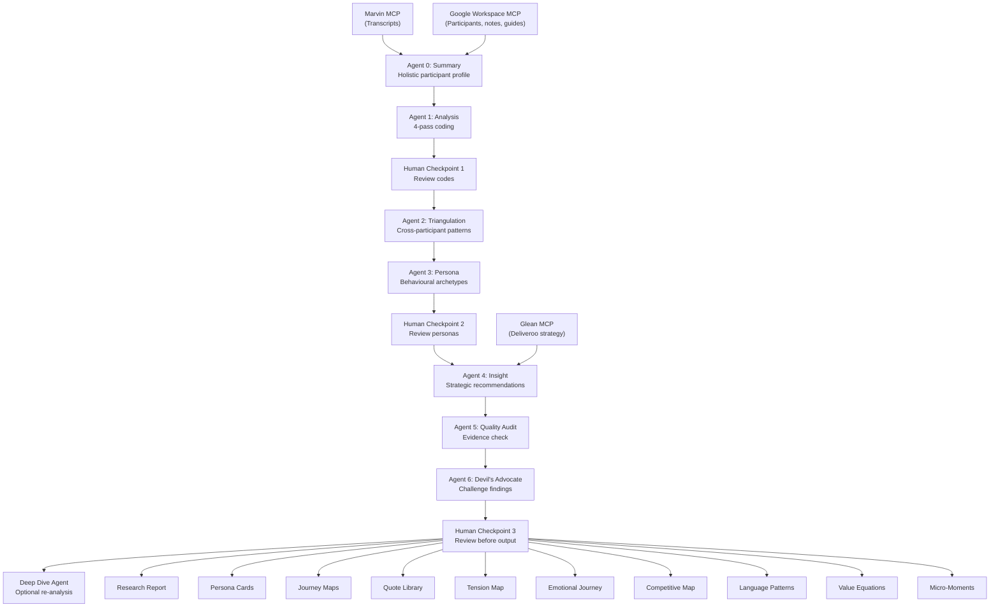

I want you to open it in the chat like you did before
# Pipeline Architecture

```mermaid
flowchart TD
    Marvin["Marvin MCP\n(Transcripts)"]
    Google["Google Workspace MCP\n(Participants, notes, guides)"]
    Glean["Glean MCP\n(Deliveroo strategy)"]

    A0["Agent 0: Summary\nHolistic participant profile"]
    A1["Agent 1: Analysis\n4-pass coding"]

    HC1["Human Checkpoint 1\nReview codes"]

    A2["Agent 2: Triangulation\nCross-participant patterns"]
    A3["Agent 3: Persona\nBehavioural archetypes"]

    HC2["Human Checkpoint 2\nReview personas"]

    A4["Agent 4: Insight\nStrategic recommendations"]
    A5["Agent 5: Quality Audit\nEvidence check"]
    A6["Agent 6: Devil's Advocate\nChallenge findings"]

    HC3["Human Checkpoint 3\nReview before output"]

    DeepDive["Deep Dive Agent\nOptional re-analysis"]

    G1["Research Report"]
    G2["Persona Cards"]
    G3["Journey Maps"]
    G4["Quote Library"]
    G5["Tension Map"]
    G6["Emotional Journey"]
    G7["Competitive Map"]
    G8["Language Patterns"]
    G9["Value Equations"]
    G10["Micro-Moments"]

    Marvin --> A0
    Google --> A0
    A0 --> A1
    A1 --> HC1
    HC1 --> A2
    A2 --> A3
    A3 --> HC2
    HC2 --> A4
    Glean --> A4
    A4 --> A5
    A5 --> A6
    A6 --> HC3
    HC3 --> DeepDive
    HC3 --> G1
    HC3 --> G2
    HC3 --> G3
    HC3 --> G4
    HC3 --> G5
    HC3 --> G6
    HC3 --> G7
    HC3 --> G8
    HC3 --> G9
    HC3 --> G10
```
