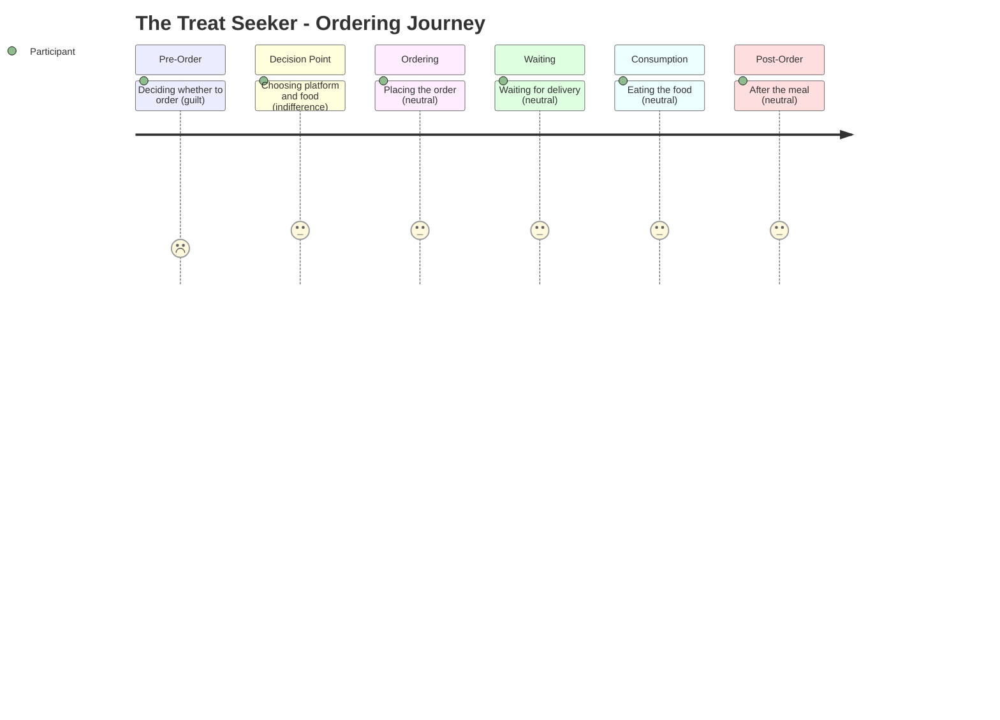

# The Treat Seeker -- Ordering Journey

## Stage Detail

- **Pre-Order**: dominant=guilt, score=2/5, emotions=[guilt]
- **Decision Point**: dominant=indifference, score=3/5, emotions=[connection, relief, stress, indifference, comfort, guilt, frustration]
- **Ordering**: dominant=neutral, score=3/5, emotions=[no data]
- **Waiting**: dominant=neutral, score=3/5, emotions=[no data]
- **Consumption**: dominant=neutral, score=3/5, emotions=[no data]
- **Post-Order**: dominant=neutral, score=3/5, emotions=[no data]
