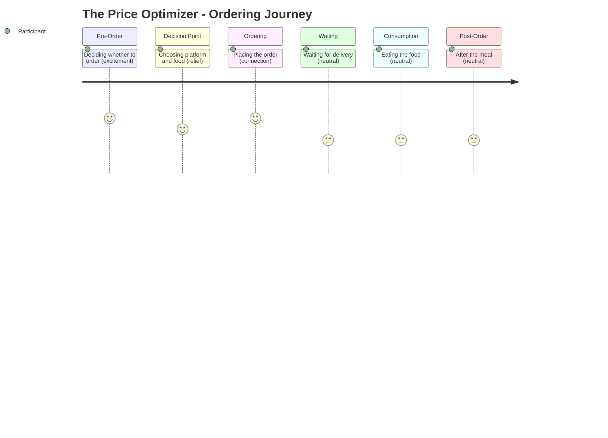

# The Price Optimizer -- Ordering Journey

## Stage Detail

- **Pre-Order**: dominant=excitement, score=5/5, emotions=[excitement]
- **Decision Point**: dominant=relief, score=4/5, emotions=[relief, stress, indifference]
- **Ordering**: dominant=connection, score=5/5, emotions=[connection]
- **Waiting**: dominant=neutral, score=3/5, emotions=[no data]
- **Consumption**: dominant=neutral, score=3/5, emotions=[no data]
- **Post-Order**: dominant=neutral, score=3/5, emotions=[no data]
