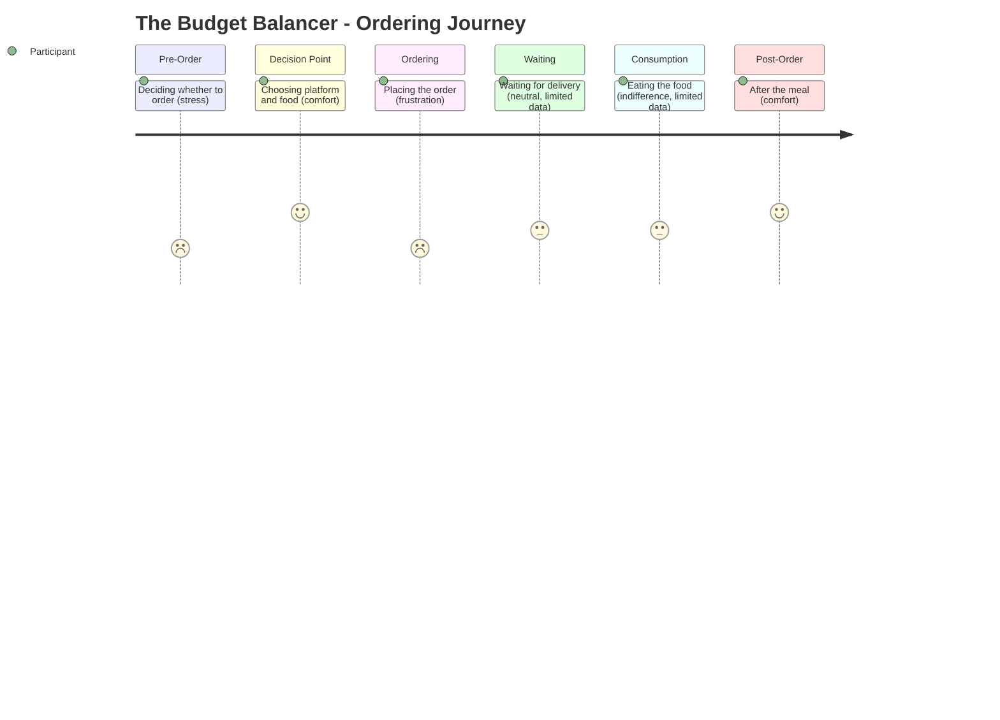

# The Budget Balancer -- Ordering Journey

## Stage Detail

- **Pre-Order**: dominant=stress, score=2/5, emotions=[frustration, anxiety, relief, excitement, joy, surprise, comfort, connection, stress]
- **Decision Point**: dominant=comfort, score=4/5, emotions=[frustration, relief, excitement, guilt, loneliness, comfort, connection, stress]
- **Ordering**: dominant=frustration, score=2/5, emotions=[frustration, anxiety, relief, joy, guilt, comfort, connection, stress]
- **Waiting**: dominant=neutral, score=3/5, emotions=[no data] **(limited data)**
- **Consumption**: dominant=indifference, score=3/5, emotions=[indifference] **(limited data)**
- **Post-Order**: dominant=comfort, score=4/5, emotions=[comfort]
