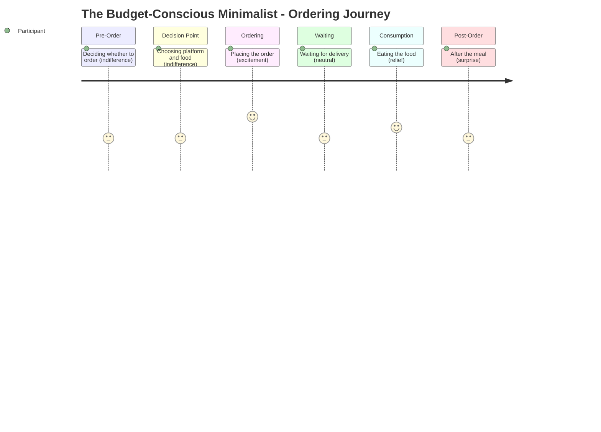

# The Budget-Conscious Minimalist -- Ordering Journey

## Stage Detail

- **Pre-Order**: dominant=indifference, score=3/5, emotions=[excitement, curiosity, anticipation, guilt, preference, necessity, approval, relief, joy, discipline, indifference, stress, comfort, frustration, connection, surprise, prioritization, trust, anxiety]
- **Decision Point**: dominant=indifference, score=3/5, emotions=[excitement, guilt, fatigue, relief, joy, indifference, stress, optimization, boredom, opportunism, comfort, sensitivity, constraint, satisfaction, frustration, loneliness, connection, adaptation, sacrifice]
- **Ordering**: dominant=excitement, score=5/5, emotions=[excitement, relief, joy, connection, empowerment, indifference, innovation, constraint, guilt, pragmatism, anxiety, frustration]
- **Waiting**: dominant=neutral, score=3/5, emotions=[no data]
- **Consumption**: dominant=relief, score=4/5, emotions=[relief, indifference]
- **Post-Order**: dominant=surprise, score=3/5, emotions=[relief, joy, comfort, surprise]
