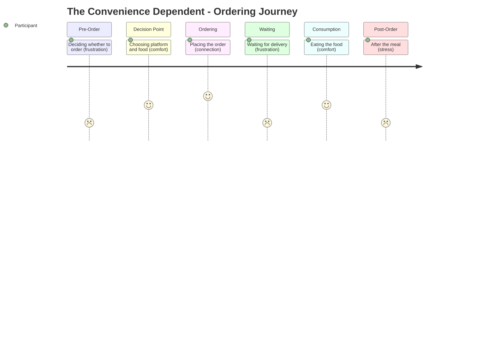

# The Convenience Dependent -- Ordering Journey

## Stage Detail

- **Pre-Order**: dominant=frustration, score=2/5, emotions=[relief, stress, excitement, pragmatic, satisfaction, suggestion, transition, connection, frustration, hope, loyalty, control, appreciation, anticipation, joy, hesitation, guilt, acknowledgment, determination, comfort]
- **Decision Point**: dominant=comfort, score=4/5, emotions=[relief, pressure, discipline, loneliness, stress, excitement, pragmatic, temptation, satisfaction, laziness, awareness, fatigue, connection, frustration, control, anticipation, guilt, determination, comfort]
- **Ordering**: dominant=connection, score=5/5, emotions=[frustration, relief, excitement, joy, anticipation, guilt, acknowledgment, loneliness, comfort, connection, conditional_trust]
- **Waiting**: dominant=frustration, score=2/5, emotions=[frustration]
- **Consumption**: dominant=comfort, score=4/5, emotions=[comfort, guilt, excitement, frustration]
- **Post-Order**: dominant=stress, score=2/5, emotions=[frustration, relief, anticipation, discipline, disappointment, comfort, stress]
