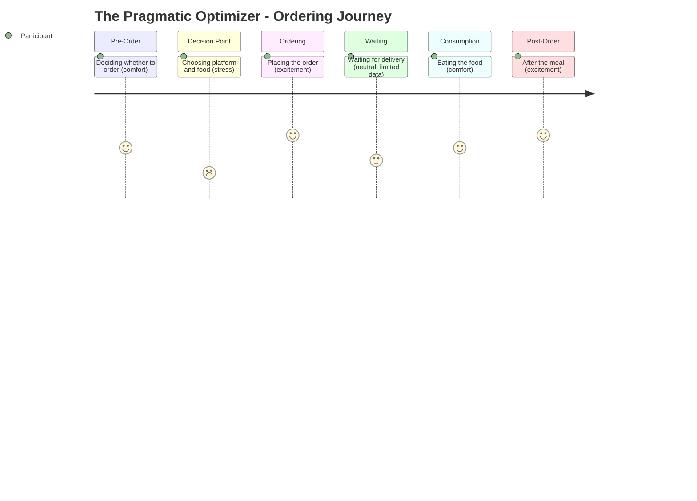

# The Pragmatic Optimizer -- Ordering Journey

## Stage Detail

- **Pre-Order**: dominant=comfort, score=4/5, emotions=[relief, prioritization, surprise, discipline, empathy, stress, excitement, interest, necessity, trust, connection, frustration, nostalgia, curiosity, anticipation, joy, preference, approval, deliberation, guilt, comfort]
- **Decision Point**: dominant=stress, score=2/5, emotions=[constraint, relief, adaptation, stress, excitement, optimization, satisfaction, opportunism, regret, fatigue, connection, frustration, concern, sensitivity, sacrifice, anticipation, joy, pride, deliberation, guilt, boredom, comfort, celebration, tiredness]
- **Ordering**: dominant=excitement, score=5/5, emotions=[frustration, constraint, innovation, relief, excitement, joy, anticipation, empowerment, deliberation, pragmatism, guilt, comfort, connection, stress]
- **Waiting**: dominant=neutral, score=3/5, emotions=[no data] **(limited data)**
- **Consumption**: dominant=comfort, score=4/5, emotions=[excitement, anticipation, joy, comfort, reflection]
- **Post-Order**: dominant=excitement, score=5/5, emotions=[control, excitement, joy, surprise, anticipation, pride, comfort, celebration, tiredness, stress]
