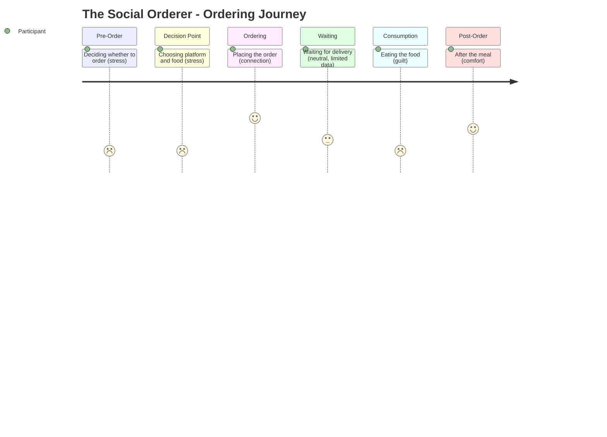

# The Social Orderer -- Ordering Journey

## Stage Detail

- **Pre-Order**: dominant=stress, score=2/5, emotions=[frustration, relief, excitement, joy, surprise, anticipation, guilt, comfort, connection, stress]
- **Decision Point**: dominant=stress, score=2/5, emotions=[frustration, exhaustion, curiosity, relief, excitement, anticipation, joy, guilt, comfort, stress]
- **Ordering**: dominant=connection, score=5/5, emotions=[frustration, relief, excitement, joy, craving, guilt, loneliness, comfort, connection, stress]
- **Waiting**: dominant=neutral, score=3/5, emotions=[no data] **(limited data)**
- **Consumption**: dominant=guilt, score=2/5, emotions=[guilt, relief, stress]
- **Post-Order**: dominant=comfort, score=4/5, emotions=[comfort, exhaustion, surprise, stress]
