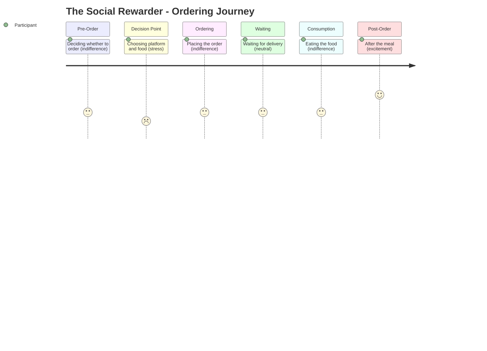

# The Social Rewarder -- Ordering Journey

## Stage Detail

- **Pre-Order**: dominant=indifference, score=3/5, emotions=[excitement, deliberation, routine, anticipation, guilt, determination, control, pragmatic, acknowledgment, relief, joy, indifference, transition, stress, hesitation, loyalty, comfort, hope, suggestion, neutral, empathy, satisfaction, frustration, connection, surprise, appreciation, nostalgia]
- **Decision Point**: dominant=stress, score=2/5, emotions=[excitement, pressure, curiosity, deliberation, anticipation, temptation, guilt, determination, control, pragmatic, tiredness, fatigue, relief, joy, discipline, indifference, stress, celebration, comfort, pride, regret, awareness, satisfaction, concern, frustration, connection, laziness]
- **Ordering**: dominant=indifference, score=3/5, emotions=[excitement, relief, connection, conditional_trust, loneliness, deliberation, indifference, anticipation, stress, guilt, frustration, comfort, acknowledgment]
- **Waiting**: dominant=neutral, score=3/5, emotions=[no data]
- **Consumption**: dominant=indifference, score=3/5, emotions=[reflection, indifference, comfort, anticipation]
- **Post-Order**: dominant=excitement, score=5/5, emotions=[excitement, joy, discipline, pride, routine, indifference, anticipation, disappointment, tiredness, celebration, comfort, frustration]
