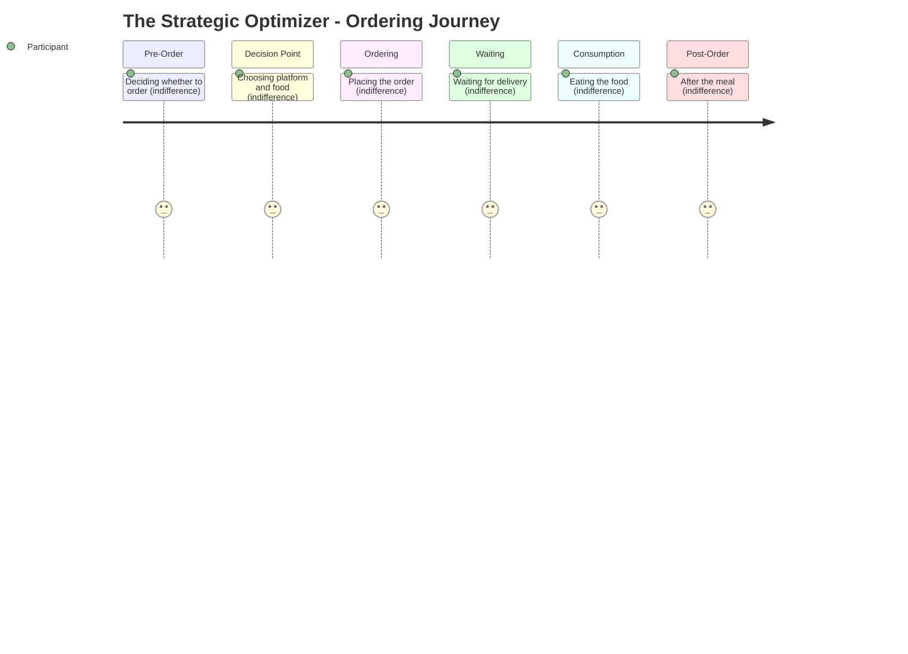

# The Strategic Optimizer -- Ordering Journey

## Stage Detail

- **Pre-Order**: dominant=indifference, score=3/5, emotions=[excitement, relief, joy, curiosity, indifference, anticipation, stress, guilt, comfort, concern, frustration]
- **Decision Point**: dominant=indifference, score=3/5, emotions=[excitement, relief, joy, connection, indifference, anticipation, stress, guilt, exhaustion, comfort, frustration]
- **Ordering**: dominant=indifference, score=3/5, emotions=[excitement, relief, connection, joy, curiosity, indifference, anticipation, stress, guilt, comfort, frustration]
- **Waiting**: dominant=indifference, score=3/5, emotions=[indifference, frustration]
- **Consumption**: dominant=indifference, score=3/5, emotions=[joy, indifference, stress, guilt, comfort]
- **Post-Order**: dominant=indifference, score=3/5, emotions=[relief, stress, indifference, comfort]
