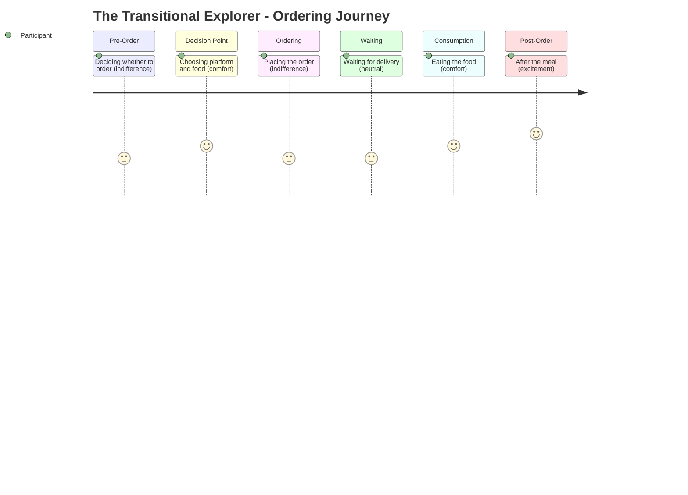

# The Transitional Explorer -- Ordering Journey

## Stage Detail

- **Pre-Order**: dominant=indifference, score=3/5, emotions=[excitement, relief, connection, indifference, anticipation, stress, guilt, comfort]
- **Decision Point**: dominant=comfort, score=4/5, emotions=[relief, loneliness, connection, indifference, anticipation, stress, comfort, frustration]
- **Ordering**: dominant=indifference, score=3/5, emotions=[excitement, connection, loneliness, indifference, anticipation, comfort, frustration]
- **Waiting**: dominant=neutral, score=3/5, emotions=[no data]
- **Consumption**: dominant=comfort, score=4/5, emotions=[comfort]
- **Post-Order**: dominant=excitement, score=5/5, emotions=[excitement, stress, indifference, anticipation]
